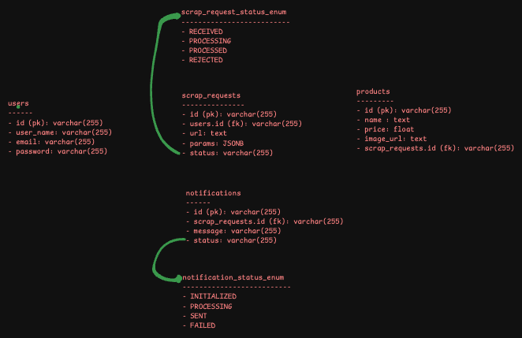
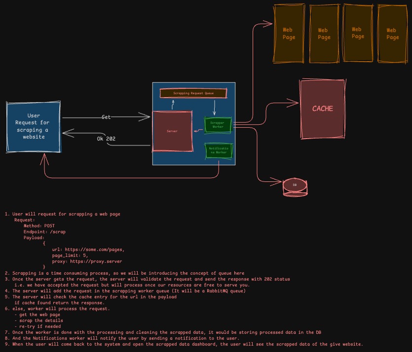
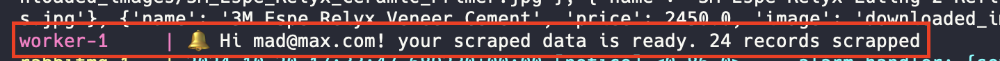
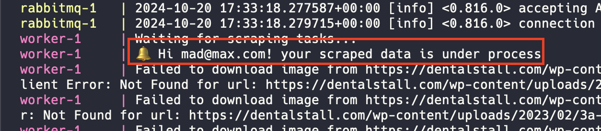
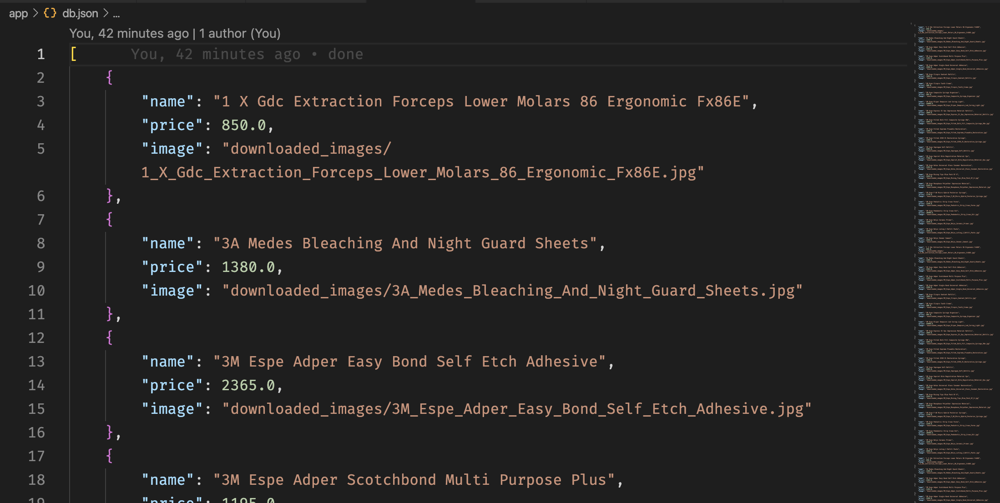

# scraper

Scraps Web and gather info.

- This is a Python (FastAPI) project
- Built using docker
- Check Docker File for more information about the configuration
- Run the app using `docker-compose rm -rf && docker-compose up --build` (If running for the first time it may take some time to build)

### Data Modeling

Notes:

- This is high level data modeling
- Something similar to this can be used while actually thinking to design such system
- IMO using non-relational DB would be the best choice for storing the scrapped data
- As the requirement might change to other kind of websites (currently it's for e-commerce website)

### Data Flow

Notes

- This is a high level data flow diagram and user interaction flow
- Used Redis for caching
- Using Queues and Workers will have a great impact when we think of scaling the system
- Horizontal scaling would be a done just in a snap as we have workers in our architecture.

### Notifications

### DB

